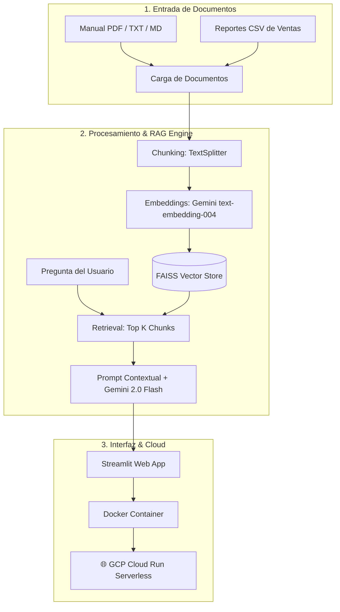

# 🤖 Alura Agente IA - Desafío Final Alura (Despliegue en GCP)

[](https://www.python.org/)
[](https://www.langchain.com/)
[](https://ai.google.dev/)
[](https://cloud.google.com/run)
[](https://streamlit.io/)

---

## 📌 Descripción del Proyecto

El **Alura Agente IA** es una solución empresarial de Inteligencia Artificial que permite a colaboradores de cualquier organización (fintechs, consultoras, startups) realizar preguntas en lenguaje natural sobre documentos internos masivos (manuales, reportes CSV, políticas en PDF, arquitecturas de software) y obtener respuestas precisas en segundos, sin necesidad de abrir ni buscar manualmente en los archivos.

### 🌟 Problema Resuelto
En las empresas, los equipos pierden horas semanales navegando entre decenas de PDFs y archivos CSV. **Alura Agente** actúa como un asistente virtual centralizado basado en **RAG (Retrieval-Augmented Generation)** que encuentra la información exacta y cita las fuentes del documento.

---

## 🏗️ Arquitectura del Sistema

El sistema implementa una arquitectura RAG en 3 capas principales:



---

## 🛠️ Tecnologías Utilizadas

- **Lenguaje:** Python 3.11
- **Orquestador IA & RAG:** LangChain
- **Modelo LLM & Embeddings:** Google Gemini API (`gemini-2.0-flash` y `text-embedding-004`)
- **Base de Datos Vectorial:** FAISS (Facebook AI Similarity Search)
- **Lectura de Documentos:** PyPDF, Pandas, CSVLoader, TextLoader
- **Interfaz Web:** Streamlit
- **Contenedorización:** Docker
- **Despliegue Cloud:** Google Cloud Platform (GCP) Cloud Run

---

## 🚀 Guía de Instalación y Ejecución Local

Sigue estos pasos para ejecutar el proyecto primero en tu computadora:

### 1. Clonar el repositorio
```bash
git clone https://github.com/tu-usuario/alura-agente.git
cd alura-agente
```

### 2. Crear un entorno virtual e instalar dependencias
```bash
# En Windows:
python -m venv venv
venv\Scripts\activate

# En macOS/Linux:
python3 -m venv venv
source venv/bin/activate

# Instalar librerías
pip install -r requirements.txt
```

### 3. Configurar las variables de entorno
Crea un archivo `.env` basado en `.env.example`:
```bash
cp .env.example .env
```
Agrega tu **API Key de Gemini** (obtenla gratis en [Google AI Studio](https://aistudio.google.com)):
```env
GEMINI_API_KEY=tu_api_key_aqui
```

### 4. Ejecutar la aplicación localmente
```bash
streamlit run app.py
```
Abre tu navegador en `http://localhost:8501`.

---

## ☁️ Guía de Despliegue en la Nube (GCP Cloud Run)

Este proyecto está listo para ser desplegado en **Google Cloud Platform (GCP) Cloud Run** en cuestión de minutos usando contenedores Serverless.

### Opción A: Despliegue en 1-Clic mediante script
- **En Linux / macOS / Cloud Shell:**
  ```bash
  chmod +x deploy_gcp.sh
  ./deploy_gcp.sh
  ```
- **En Windows:**
  ```cmd
  deploy_gcp.bat
  ```

### Opción B: Despliegue manual con `gcloud` CLI
```bash
# 1. Autenticarse e indicar el proyecto GCP
gcloud auth login
gcloud config set project TU_ID_DE_PROYECTO_GCP

# 2. Habilitar los servicios requeridos
gcloud services enable run.googleapis.com cloudbuild.googleapis.com

# 3. Construir y desplegar automáticamente en Cloud Run
gcloud run deploy alura-agente \
  --source . \
  --platform managed \
  --region us-central1 \
  --allow-unauthenticated \
  --memory 1Gi
```

Al finalizar, la consola mostrará la **URL pública HTTPS** de la aplicación lista para presentar en el challenge.

---

## 💬 Preguntas de Prueba y Validación

Puedes probar el agente cargando los documentos incluidos en la carpeta `sample_data/`:

### Prueba 1: Documento de Ventas (`datos_ventas_2015.csv`)
- **Pregunta:** *"¿Cuál fue el producto más vendido en diciembre de 2015?"*
- **Respuesta esperada:** El producto más vendido en cantidad fue el **Teclado Mecánico RGB** (300 unidades) y en facturación total fueron las **Licencias ERP Cloud** ($75,000 USD).

### Prueba 2: Documento de Tecnologías y Políticas (`manual_tecnologia_y_politicas.md`)
- **Pregunta:** *"¿Qué lenguajes de programación se usan en el back-end de la plataforma de ventas?"*
- **Respuesta esperada:** En el back-end de la plataforma de ventas se utilizan principalmente **Python (FastAPI)** para microservicios de IA, **Go (Golang)** y **Node.js (NestJS)** para transacciones e inventario.

---

## 📸 Evidencia de Despliegue en GCP

- **URL de la App en Línea:** `https://alura-agente-xxxxx-uc.a.run.app` *(Reemplazar con tu URL de GCP)*
- **Captura de Pantalla:**


---

## 📄 Licencia y Créditos

Proyecto desarrollado como Desafío Final para la formación de Inteligencia Artificial de Alura Latam.
