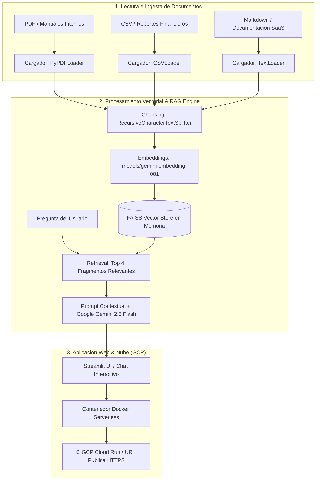

# 🤖 Alura Agente IA - Desafío Final Alura (Oracle Next Education - ONE)

[](https://www.python.org/)
[](https://www.langchain.com/)
[](https://ai.google.dev/)
[](https://cloud.google.com/run)
[](https://streamlit.io/)

---

## 📌 Descripción General del Proyecto

**Alura Agente IA** es una solución de Inteligencia Artificial Corporativa desarrollada como **Desafío Final para la Formación de Inteligencia Artificial (Alura Latam & Oracle Next Education - ONE)**.

El objetivo del proyecto es resolver el problema de la pérdida de tiempo en empresas (fintechs, consultoras y startups) al buscar información en grandes volúmenes de documentos internos (manuales de arquitectura, reportes financieros CSV, políticas de RRHH y documentación de plataformas SaaS).

La solución consiste en un asistente inteligente capaz de procesar cualquier documento (**PDF, CSV, TXT o MD**) y responder preguntas directas en lenguaje natural mediante un pipeline de **RAG (Retrieval-Augmented Generation)** de alta precisión, citando los fragmentos fuente consultados.

---

## 🏗️ Arquitectura de la Solución Implementada

El sistema funciona mediante una arquitectura modular en 3 capas:



---

## 🛠️ Tecnologías y Herramientas Utilizadas

- **Lenguaje:** Python 3.11
- **Framework IA & RAG:** LangChain (`langchain-google-genai`, `langchain-community`)
- **Modelos de Inteligencia Artificial:**
  - **LLM (Generación de respuestas):** Google Gemini (`models/gemini-2.5-flash`)
  - **Embeddings (Vectorización):** Google Gemini (`models/gemini-embedding-001`)
- **Base de Datos Vectorial:** FAISS (Facebook AI Similarity Search)
- **Lectura de Datos:** PyPDF, Pandas, CSVLoader, TextLoader
- **Interfaz Web:** Streamlit
- **Contenedorización:** Docker
- **Infraestructura Cloud:** Google Cloud Platform (GCP) Cloud Run

---

## 🚀 Instrucciones para Ejecutar el Proyecto Localmente

### 1. Clonar el repositorio
```bash
git clone https://github.com/nextorsalinas/alura_agente.git
cd alura_agente
```

### 2. Crear entorno virtual e instalar dependencias
```bash
# En Windows (PowerShell):
python -m venv venv
.\venv\Scripts\activate

# En macOS/Linux:
python3 -m venv venv
source venv/bin/activate

# Instalar librerías requeridas
pip install -r requirements.txt
```

### 3. Configurar la API Key de Gemini
Crea un archivo `.env` en la raíz del proyecto basándote en `.env.example`:
```env
GEMINI_API_KEY=tu_api_key_de_google_ai_studio
```

### 4. Iniciar la aplicación Web
```bash
streamlit run app.py
```
Abre tu navegador en `http://localhost:8501`.

---

## ☁️ Instrucciones para el Despliegue en la Nube (GCP Cloud Run)

El proyecto incluye scripts de despliegue automático para **Google Cloud Platform (GCP) Cloud Run**:

### Ejecutar Despliegue Automático:
- **En Windows:** `.\deploy_gcp.bat`
- **En Linux / macOS / Cloud Shell:** `chmod +x deploy_gcp.sh && ./deploy_gcp.sh`

### Comandos manuales `gcloud`:
```bash
gcloud auth login
gcloud config set project TU_ID_PROYECTO_GCP
gcloud services enable run.googleapis.com cloudbuild.googleapis.com
gcloud run deploy alura-agente --source . --region us-central1 --allow-unauthenticated
```

---

## 💬 Ejemplos de Preguntas y Respuestas Generadas por el Agente

Puedes validar el funcionamiento del agente cargando los documentos incluidos en `sample_data/`:

### Ejemplo 1: Documento CSV de Ventas (`datos_ventas_2015.csv`)
- **Pregunta:** *"¿Cuál fue el producto más vendido en diciembre de 2015?"*
- **Respuesta del Agente:** 
  > *"El producto más vendido en diciembre de 2015, basándose en la cantidad de unidades vendidas, fue el **Teclado Mecánico RGB** con 300 unidades."*

### Ejemplo 2: Documento de Arquitectura y Políticas (`manual_tecnologia_y_politicas.md`)
- **Pregunta:** *"¿Qué lenguajes de programación se usan en el back-end de la plataforma de ventas?"*
- **Respuesta del Agente:** 
  > *"Los lenguajes de programación utilizados en el back-end de la plataforma de ventas son **Python (con FastAPI)** para microservicios de IA, y **Go (Golang)** junto con **Node.js (NestJS)** para transacciones de ventas e inventario."*

### Ejemplo 3: Documentación SaaS y Plataforma (`documentacion_saas_plataforma.md`)
- **Pregunta:** *"¿Cuáles son los planes y precios mensuales disponibles?"*
- **Respuesta del Agente:** 
  > *"Los planes disponibles son: **Plan Starter** ($29 USD/mes) hasta 5 usuarios y 50 GB; **Plan Pro** ($99 USD/mes) hasta 25 usuarios y 500 GB; y **Plan Enterprise** con cotización personalizada para usuarios ilimitados y nube dedicada."*

---

## 📸 Evidencia del Despliegue en la Nube

- **URL Pública del Agente:** `https://alura-agente-xxxxx-uc.a.run.app` *(Verifica en tu consola de GCP)*
- **Captura del Agente en Ejecución:**


---

## 📋 Lista de Chequeo de Entregables Cumplidos

- [x] Repositorio público en GitHub (`https://github.com/nextorsalinas/alura_agente`).
- [x] Historial de commits estructurado.
- [x] Estructura modular y limpia del código (`app.py`, `rag_engine.py`, `Dockerfile`).
- [x] README detallado con arquitectura en Mermaid, tecnologías, instalación y ejemplos.
- [x] Agente IA funcional con RAG para PDF, CSV, TXT y MD.
- [x] Configuración de contenedor Docker y despliegue Serverless en Cloud.
